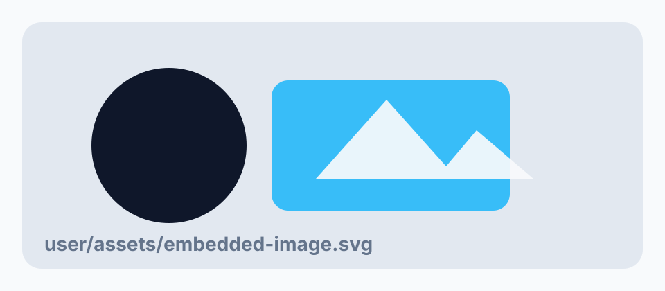

## A paginated section generated from markdown
kicker: Section 01
metric: 92%
note: This card uses break-inside: avoid, so it should move as a single block when possible.

This paragraph belongs to section 1 and is generated from the markdown document model. It is intentionally verbose so that Paged.js has enough content to fragment into pages. The template is Alpine-driven, but the pagination output is produced by Paged.js. File changes refresh the browser through server-sent events.

This paragraph shows the parser boundary. A custom markdown parser can replace the temporary implementation later without changing the Flask routes or browser update logic.

## Another markdown-driven section
kicker: Section 02
metric: 88%
note: Section metadata is optional and lives beside the prose in the markdown source.

The browser never reads this markdown file directly. Flask parses it into JSON, serves that JSON to Alpine, and notifies the page when either the content or template changes.

The user template contains only declarative Alpine bindings. Fetching, watching, injection, Alpine initialization, and Paged.js rendering stay in the application JavaScript.

## Template updates are live too
kicker: Section 03
metric: 96%
note: Editing user/template.html should trigger the same refresh path as editing user/content.md.

The source article is hidden, initialized with Alpine, and then passed to Paged.js as plain HTML. The already-rendered paged preview remains the printable target.

Keeping the update pipeline outside the template makes the editable template safer and keeps the repo ready for a stronger parser later.

